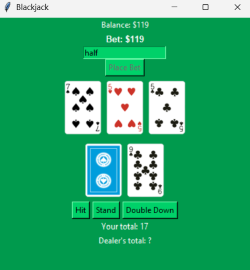

# Blackjack

## Overview
This repository contains simple Blackjack game built using Python and Tkinter. It features betting mechanics, currency, and a graphical representation of cards. The game starts with a balance of $100, and players can place bets, hit, stand, or double down to try and beat the dealer.

## Features
- Playable Blackjack game with betting mechanics
- Graphical user interface using Tkinter
- Card visualization with suits and colors
- Double Down functionality
- Automatic dealer logic
- Balance tracking and win/loss conditions

## How to Play
1. Enter your own bet amount, and then press "Place Bet".
2. You and the dealer are each dealt two cards.
3. Choose to "Hit" (draw another card), "Stand" (keep your current hand), or "Double Down" (double your bet and draw only one more card).
4. The dealer will draw until they reach at least 17.
5. Win by getting a higher total than the dealer without going over 21.
6. If you win, your balance increases based on your bet. If you lose, your bet is deducted.
7. The game ends when your balance reaches 0 (resets to $1 to keep playing).

## Tips & Tricks
- You can use "all" or "half" as a bet amount to place the respective amount as a bet.
- You can easily change the color of the card back and the color of the ui in `ui_colors.py`.

## License
This project is licensed under the MIT License. See the `LICENSE` file for details.
